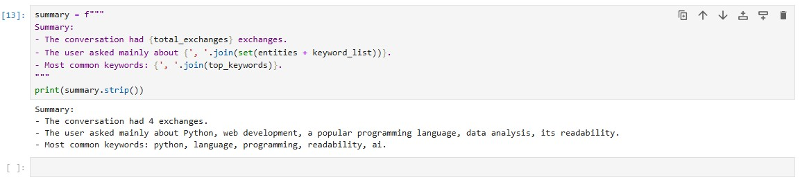
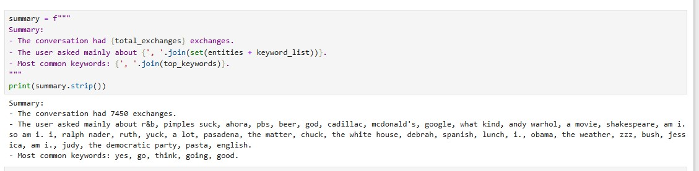

<h2>Project Description: </h2>

The project focuses on analyzing conversational data (chat logs) using 
<strong>Natural Language Processing (NLP)</strong> techniques to extract meaningful insights. 
The chat logs are processed to identify key themes, extract named entities, and summarize the conversation.

Python libraries are used in the project: <strong>spaCy</strong>, <strong>scikit-learn</strong>, 
the project demonstrates how to:

<ul>
    <li>Identify frequently used <strong>keywords</strong> via <strong>TF-IDF</strong></li>
    <li>Extract <strong>named entities</strong></li>
    <li>Find common <strong>noun phrases</strong> to understand the main topics</li>
    <li>Generate a short <strong>summary</strong> of the entire conversation</li>
</ul>

<h2>Features</h2>
<ul>
    <li>Text preprocessing and merging of chat messages</li>
    <li>Named Entity Recognition (NER) with spaCy</li>
    <li>Noun Chunk Extraction for topic inference</li>
    <li>TF-IDF-based Keyword Extraction using scikit-learn</li>
    <li>Conversation Summarization using sumy (optional)</li>
</ul>

<h2>Technologies Used</h2>
<ul>
    <li>Python</li>
    <li>Pandas</li>
    <li>TF-IDF
    <li>spaCy</li>
    <li>Scikit-learn</li>
</ul>

<h2>Use Cases</h2>
<ul>
    <li>Automated summarization of chat transcripts</li>
    <li>Extracting action points from support logs</li>
    <li>NLP pipelines for CRM or help desk software</li>
    <li>Customer feedback keyword analysis</li>
</ul>

<h2>How to Run the Project</h2>

<h3> 1. Environment Setup</h3>

The <strong>Python installed</strong>. Then install the required packages using the following:

<pre><code>pip install pandas scikit-learn spacy matplotlib sumy
python -m spacy download en_core_web_sm
</code></pre>

<pre><code>pip install scikit-learn nltk
import nltk
nltk.download('stopwords')
</code></pre>

<h3> 2. Input Data Format</h3>

The input file is a chat.txt

The code assumes a column named <code>message</code> containing the chat text.

<h3> 3. Run the Notebook</h3>

To execute the project:

<ol>
  <li>Open the notebook (<code>ChatLog.ipynb</code>) in Jupyter</li>
  <li>Step through the cells sequentially.</li>
  <li>The key steps performed:
    <ul>
      <li>Load the dataset</li>
      <li>Preprocess text</li>
      <li>Use <code>spaCy</code> for named entities and noun chunks</li>
      <li>Use <code>TF-IDF</code> and <code>Counter</code> for keyword extraction</li>
      <li>Generate a brief summary</li>
    </ul>
  </li>
</ol>

<h2>Explanation of the project: </h2>

<h2>1. Importing Libraries</h2>
<pre><code>import pandas as pd
import spacy
from sklearn.feature_extraction.text import TfidfVectorizer
from collections import Counter
</code></pre>

<strong>Purpose:</strong>

<ul>
  <li><code>pandas</code>: for loading and manipulating tabular data</li>
  <li><code>spacy</code>: for natural language processing (NER, noun chunks, etc.)</li>
  <li><code>TfidfVectorizer</code>: to extract keywords using TF-IDF</li>
  <li><code>Counter</code>: to count frequency of noun chunks or tokens</li>
</ul>

<h2>2. Load spaCy Model</h2>
<pre><code>nlp = spacy.load("en_core_web_sm")</code></pre>

<strong>Purpose:</strong>

<ul>
  <li>Loads a pre-trained English NLP model from spaCy. Required for:</li>
  <li>Tokenization</li>
  <li>Named Entity Recognition (NER)</li>
  <li>Noun chunk extraction</li>
</ul>

<h2>3. Load and Combine Chat Messages</h2>
<pre><code>df = pd.read_csv('chat.csv')
full_text = " ".join(df['message'].tolist())</code></pre>

<strong>Purpose:</strong>

<ul>
  <li>Loads a chat log txt (<code>chat.txt</code>)</li>
  <li>Combines all messages into one large text block for analysis</li>
</ul>

<h2>4. Process Text with spaCy</h2>
<pre><code>doc = nlp(full_text)</code></pre>

<strong>Purpose:</strong>

<ul>
  <li>Runs the combined text through spaCy's NLP pipeline</li>
  <li>Gives access to tokens, entities, and noun phrases</li>
</ul>

<h2>5. Extract Noun Chunks</h2>
<pre><code>noun_chunks = [chunk.text.lower() for chunk in doc.noun_chunks]
keywords = Counter(noun_chunks).most_common(5)
keyword_list = [kw[0] for kw in keywords]
print("Top Noun Chunks:", keyword_list)</code></pre>

<strong>Purpose:</strong>

<ul>
  <li>Finds common <strong>noun phrases</strong> (e.g., "chat log", "data frame")</li>
  <li>Uses <code>Counter</code> to get top 5 most frequent chunks</li>
</ul>

<h2>6. TF-IDF Keyword Extraction</h2>
<pre><code>vectorizer = TfidfVectorizer(stop_words='english')
X = vectorizer.fit_transform(df['message'])
feature_names = vectorizer.get_feature_names_out()
dense = X.todense()
denselist = dense.tolist()
tfidf_df = pd.DataFrame(denselist, columns=feature_names)

tfidf_sum = tfidf_df.sum().sort_values(ascending=False)
print("Top TF-IDF Keywords:", tfidf_sum.head(5))</code></pre>

<strong>Purpose:</strong>

<ul>
  <li>Applies <strong>TF-IDF</strong> to identify keywords that are frequent but meaningful (not common stopwords)</li>
  <li>Outputs top words with the highest TF-IDF score</li>
</ul>

<h2> Example Output: Chat Summarization</h2>

Below are two examples showing how the project summarizes different types of chat logs.

<h3>Example 1: Short Chat.txt</h3>

This summary shows a brief conversation about User and AI.

<h3>Example 2: Random Chat Dataset</h3>

This summary demonstrates analysis of a large dataset with thousands of exchanges.

